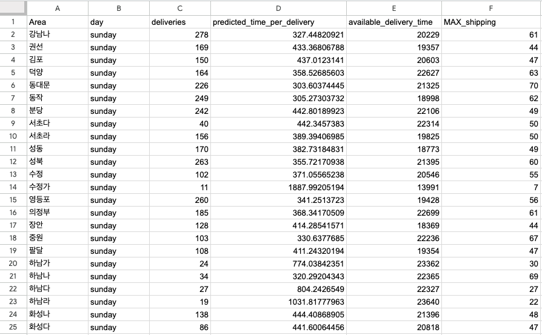

# Delivus Delivery MAX Predictor

## 물량·지역·요일 기반 지역별 최대 배송량(MAX) 예측 Production MLOps 시스템

> 회사 DB의 운영 데이터를 기반으로 물량·지역·요일별 총 배송 소요시간을 예측하고,  
> 기사 스케줄과 지역별 가용시간을 결합하여 **운영 가능한 최대 배송량(MAX)** 을 자동 산출하는 시스템입니다.  
> 산출된 MAX 값은 클러스터링 Lambda의 입력값으로 활용되어 기사별 과·소배차를 줄이고, 당일배송 SLA 안정성을 높이는 데 사용됩니다.

---

## Executive Impact

- **운영 의사결정 자동화**  
  경험 기반으로 판단하던 기사별 최대 배송량 산정을 데이터 기반 자동화 체계로 전환

- **SLA 안정성 향상**  
  예측 MAX 기반 배차로 전체 배송 권역 SLA가 **97.15% → 97.93%** 로 약 **0.78% 개선**

- **클러스터링 품질 개선**  
  Postalcode Clustering Lambda 실행 전 최신 MAX 값을 자동 공급하여 기사별 물량 균형 개선

- **일일 자동 운영 파이프라인 구축**  
  AWS Lambda + EventBridge 기반으로 매일 자동 실행되며, 결과는 Google Sheets에 자동 업데이트

- **DB 직결 기반 안정적 운영**  
  외부 BI 도구 의존 없이 회사 DB에서 직접 데이터 로딩 → 학습 → 추론 → 결과 반영까지 수행

---

## 비즈니스 문제 (Business Problem)

당일배송 운영에서는 기사별로 “하루에 몇 개까지 배송 가능한가”를 정확히 판단하는 것이 중요합니다.

MAX 값이 과도하게 높으면 특정 기사에게 물량이 몰려 배송 지연이 발생하고,  
반대로 낮게 잡히면 기사 리소스를 충분히 활용하지 못해 운영 효율이 떨어집니다.

기존 방식의 한계는 다음과 같았습니다.

- 운영자의 경험 기반 MAX 산정
- 지역별 배송 난이도 차이 반영 어려움
- 요일별 물량 패턴 반영 부족
- 고정 기사 / FLEX 기사별 처리 가능량 구분 필요
- 클러스터링 직전 최신 기준값 반영 어려움
- 과배차·저배차로 인한 SLA 변동성 발생

따라서 MAX 산정은 단순 참고 지표가 아니라,  
**배송 클러스터링 품질과 SLA 안정성을 결정하는 핵심 운영 파라미터**였습니다.

---

## 서비스 기능 (Service Features)

Delivery MAX Predictor는 다음 기능을 수행합니다.

- 회사 DB의 과거 배송 운영 데이터를 기반으로 총 배송 소요시간 예측
- 지역·요일·물량·기사 스케줄을 반영한 MAX 산출
- 지역별 가용시간과 예측 배송시간을 결합한 운영 가능 물량 계산
- 고정 기사 / FLEX 기사별 MAX 값 자동 분배
- AWS Lambda Image + EventBridge 기반 일일 자동 실행
- 최종 결과를 Google Sheets에 자동 업데이트
- 산출된 MAX 값을 Postalcode Clustering Lambda의 입력 데이터로 활용

---

## 내가 수행한 역할 (My Role)

본 프로젝트에서 데이터 로딩부터 모델 학습, 추론, 운영 반영까지 End-to-End로 구현했습니다.

- Lambda VPC 설정을 통한 회사 DB 직접 연동 구조 구성
- 학습·추론용 운영 데이터셋 설계 및 전처리
- 지역·요일·물량 기반 총 배송 소요시간 예측 모델 개발
- **LightGBM 기반 예측 파이프라인 구현**
- 예측값과 기사 가용시간을 결합한 MAX 산출 로직 설계
- 기사 스케줄 기반 고정/FLEX 기사별 MAX 분배 로직 구현
- AWS SAM Image 기반 Lambda 배포
- EventBridge 스케줄러를 통한 일일 자동 실행 구성
- Google Sheets API 연동으로 운영팀 사용 화면 자동 업데이트
- 산출 결과를 클러스터링 시스템의 upstream 데이터로 연결

---

## 핵심 구현 프로세스 (Core Process)

### 1. DB 직접 연동

Lambda `template.yaml`에 VPC Subnet / Security Group 설정을 적용하여  
회사 내부 DB에 직접 접근할 수 있도록 구성했습니다.

```text
AWS Lambda
  → VPC Subnet / Security Group
  → Company DB
  → Historical Operation Data Load
```

이를 통해 별도 파일 업로드나 BI 도구를 거치지 않고,  
실제 운영 데이터를 기반으로 학습과 추론이 수행되도록 만들었습니다.

---

### 2. 데이터 전처리 및 학습

회사 DB에서 배송 완료 이력, 지역, 요일, 기사 스케줄, 물량 데이터를 조회한 뒤  
모델 학습에 필요한 형태로 전처리합니다.

주요 피처 예시는 다음과 같습니다.

| Feature | Description |
|---|---|
| 지역 | 배송 권역 / Area |
| 요일 | weekday 기반 물량·생산성 패턴 |
| 물량 | 지역별 배송 아이템 수 |
| 기사 스케줄 | 고정 기사 / FLEX 기사 가용 여부 |
| 총 배송 소요시간 | 모델이 예측할 target |

모델은 **LightGBM** 기반으로 구성하여  
지역·요일·물량 조건에 따른 총 배송 소요시간을 예측합니다.

---

### 3. 추론 및 가용시간 결합

당일 물량과 지역별 조건을 입력으로 추론을 수행한 뒤,  
예측된 총 배송 소요시간을 기사 가용시간과 결합합니다.

```text
예측 총 배송 소요시간
+ 지역별 가용시간
+ 기사 스케줄
+ 운영 조건
= 지역별 운영 가능 MAX
```

이 과정에서 단순 모델 예측값만 사용하는 것이 아니라,  
실제 운영 가능한 시간과 기사 스케줄을 함께 고려해 결과를 보정합니다.

---

### 4. MAX 계산

예측된 총 소요시간과 기사 스케줄을 바탕으로  
기사 타입별 최대 배송 가능량을 계산합니다.

```text
지역별 총 물량
→ 예측 배송 소요시간
→ 기사 가용시간 대비 처리 가능량 계산
→ 고정 기사 / FLEX 기사별 MAX 분배
→ 최종 MAX 산출
```

최종 산출값은 클러스터링 시스템에서 기사별 물량 제한 기준으로 사용됩니다.

---

### 5. 운영 자동화

본 시스템은 단발성 분석 스크립트가 아니라,  
매일 자동 실행되는 운영 파이프라인으로 구성했습니다.

```text
EventBridge Scheduler
        ↓
MAX Predictor Lambda
        ↓
DB Data Load
        ↓
Model Inference / MAX Calculation
        ↓
Google Sheets Update
        ↓
Postalcode Clustering Lambda에서 최신 MAX 활용
```

EventBridge를 통해 매일 클러스터링 실행 전 자동으로 동작하도록 구성하여,  
운영팀이 매번 수동으로 기준값을 계산하지 않아도 되도록 만들었습니다.

---

### 6. 결과 반영

최종 MAX 값은 Google Sheets에 자동 업데이트됩니다.

운영팀은 별도 쿼리나 파일 가공 없이,  
클러스터링 직전 최신 MAX 기준값을 시트에서 바로 확인하고 활용할 수 있습니다.



---

## 시스템 아키텍처 (Architecture)

```text
EventBridge Scheduler
        ↓
AWS Lambda (SAM Image)
        ↓
VPC / Subnet / Security Group
        ↓
Company DB
        ↓
Feature Engineering
        ↓
LightGBM Training / Batch Inference
        ↓
MAX Capacity Calculation
        ↓
Google Sheets API Update
        ↓
Postalcode Clustering Lambda Input
```

---

## 기술 스택 (Tech Stack)

- **Python**
- Pandas / NumPy
- LightGBM
- AWS Lambda
- AWS SAM
- Lambda Container Image
- EventBridge Scheduler
- VPC / Subnet / Security Group
- MySQL / PostgreSQL
- Google Sheets API
- CloudWatch Logs

---

## 운영 결과 화면 (Operational Output)

MAX Predictor는 산출 결과를 Google Sheets에 자동 반영합니다.

이 시트는 운영팀이 클러스터링 직전 확인하는 기준 데이터로 활용되며,  
지역별 / 요일별 / 기사 타입별 MAX 값이 자동으로 업데이트됩니다.


---

## 클러스터링 시스템과의 연결 구조

Delivery MAX Predictor는 Postalcode Clustering Lambda의 upstream 시스템입니다.

```text
Delivery MAX Predictor
        ↓
지역별 / 기사별 MAX 산출
        ↓
Google Sheets 업데이트
        ↓
Postalcode Clustering Lambda에서 MAX 로딩
        ↓
기사별 클러스터 물량 제한에 반영
        ↓
허브앱 클러스터링 결과 생성
```

즉, MAX Predictor는 단독 모델이 아니라  
실제 클러스터링 품질을 결정하는 핵심 입력값 생성 시스템입니다.

---

## 성과 지표 (Measured Results)

| 지표 | 개선 전 | 개선 후 | 효과 |
|---|---:|---:|---:|
| MAX 산정 방식 | 경험 기반 수동 판단 | ML 기반 자동 산출 | 운영 의사결정 자동화 |
| SLA | 97.15% | 97.93% | +0.78% 개선 |
| 기준값 반영 | 수동 업데이트 | 매일 자동 업데이트 | 최신성 확보 |
| 클러스터링 입력값 | 고정/경험값 의존 | 예측 기반 MAX | 물량 균형 개선 |
| 운영팀 작업 | 수작업 계산·확인 | Google Sheets 자동 반영 | 업무 부담 감소 |

---

## 왜 이 프로젝트가 강한 MLOps 경험인가?

이 프로젝트는 단순히 모델을 학습한 것이 아니라,  
**운영 의사결정에 사용되는 핵심 지표를 ML 시스템으로 자동 생성하고 Production 환경에서 매일 실행되도록 만든 사례**입니다.

### MLOps 관점에서의 핵심 역량

- 회사 DB 직접 연동 기반 데이터 파이프라인 구축
- Feature Engineering → Training → Batch Inference 자동화
- AWS Lambda 기반 서버리스 운영 시스템 구축
- EventBridge를 통한 주기적 실행 자동화
- Google Sheets를 통한 운영팀 사용 화면 연동
- Downstream 클러스터링 시스템과 연결
- KPI 기반 성과 측정 및 운영 개선

---

## Repository Structure

```text
Max_deli_portfolio/
├── README.md
├── template.yaml
├── Dockerfile
├── app.py
├── requirements.txt
├── events/
├── src/
│   ├── data/
│   ├── features/
│   ├── model/
│   ├── predict/
│   └── sheets/
└── docs/
    └── images/
        └── image1.png
```

> 실제 파일 구조에 따라 세부 디렉토리명은 조정될 수 있습니다.

---

## Key Takeaway

> 운영팀이 경험적으로 판단하던 기사별 최대 배송량(MAX)을  
> 머신러닝 예측 모델과 AWS 자동화 파이프라인으로 전환하여,  
> 실제 SLA 개선과 클러스터링 품질 향상을 만든 Production MLOps 프로젝트입니다.